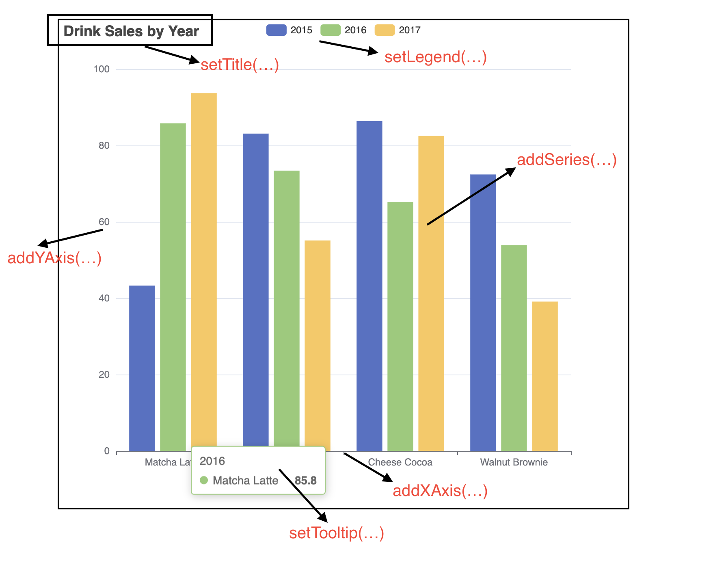

# Quick Start

## Installation

For Maven project, includes the following in your pom.xml
```xml
<dependency>
  <groupId>org.icepear.echarts</groupId>
  <artifactId>echarts-java</artifactId>
  <version>1.0.2</version>
</dependency>
```

For Gradle Groovy project, includes
```
implementation 'org.icepear.echarts:echarts-java:1.0.2'
```

For others, see [here](https://search.maven.org/artifact/org.icepear.echarts/echarts-java/1.0.2/jar).

## Getting Started

### Make Visualization Locally and Saved the Image

?> Let's draw our first EChart! You can use ECharts Java to generate the charts you want, see it in the browser, and save the chart as image if you want!

```java
public static void main(String[] args) {
    // All methods in ECharts Java supports method chaining
    Bar bar = new Bar()
            .setTooltip(new Tooltip().setTrigger("axis")
                    .setAxisPointer(new TooltipAxisPointer().setType("shadow")))
            .setLegend(true)
            .addXAxis()
            .addYAxis(new String[] { "Mon", "Tue", "Wed", "Thu", "Fri", "Sat", "Sun" })
            .addSeries(createSeries("Direct", new Number[] { 320, 302, 301, 334, 390, 330, 320 }))
            .addSeries(createSeries("Mail Ad", new Number[] { 120, 132, 101, 134, 90, 230, 210 }))
            .addSeries(createSeries("Affiliate Ad", new Number[] { 220, 182, 191, 234, 290, 330, 310 }))
            .addSeries(createSeries("Video Ad", new Number[] { 150, 212, 201, 154, 190, 330, 410 }))
            .addSeries(createSeries("Search Engine", new Number[] { 820, 832, 901, 934, 1290, 1330, 1320 }));
    Engine engine = new Engine();
    // The render method will generate our EChart into a HTML file saved locally in the current directory.
    // The name of the HTML can also be set by the first parameter of the function.
    engine.render("index.html", bar);
}
```
[basic-area-html](_media/bar/multiple-series-bar.html ':include :type=iframe')

### Construct Option Object

?> In ECharts, every chart is composed of Option object. That means, if you want to make visualization in ECharts, it is necessary to build an Option object. ECharts Java understands that it may be nontrivial to build an Option from the scratch. As a result, ECharts Java wraps the original APIs, transforming the process of building an Option into a process of writing script-like codes. Meanwhile, ECharts Java also preserves the original APIs, helping the advanced users to construct complicated Option object in Java. This, together with the template rendering, will help the backend developers implement visualization application without caring about the JavaScript details.

```java
// Construct Option object using the simplified Chart APIs
Line lineChart = new Line()
                .addXAxis(new CategoryAxis()
                        .setData(new String[] { "Mon", "Tue", "Wed", "Thu", "Fri", "Sat", "Sun" })
                        .setBoundaryGap(false))
                .addYAxis()
                .addSeries(new LineSeries()
                        .setData(new Number[] { 820, 932, 901, 934, 1290, 1330, 1320 })
                        .setAreaStyle(new LineAreaStyle()));
            
// Every Chart has its own Option Object
Option option = lineChart.getOption();
// It is recommended that you can  get the serialized version of Option in the representation of JSON, which can be used directly in the template or in the RESTful APIs.
Engine engine = new Engine();
String jsonStr = engine.renderJsonOption(lineChart);
```

The corresponding JSON string looks like the following,

```json
{
  "xAxis": [
    {
      "type": "category",
      "data": ["Mon", "Tue", "Wed", "Thu", "Fri", "Sat", "Sun"],
      "boundaryGap": false
    }
  ],
  "yAxis": [{ "type": "value" }],
  "series": [
    {
      "type": "line",
      "data": [820, 932, 901, 934, 1290, 1330, 1320],
      "areaStyle": {}
    }
  ]
}
```

For advanced usage, the Option object can also be constructed as follows,
```java
// Construct Option object of a Bar chart using the advanced APIs
CategoryAxis xAxis = new CategoryAxis()
                .setType("category")
                .setData(new String[] { "Mon", "Tue", "Wed", "Thu", "Fri", "Sat", "Sun" });

ValueAxis yAxis = new ValueAxis().setType("value");

BarSeries series = new BarSeries()
        .setData(new Number[] { 120, 200, 150, 80, 70, 110, 130 })
        .setType("bar");

Option option = new Option()
        .setXAxis(xAxis)
        .setYAxis(yAxis)
        .setSeries(new SeriesOption[] { series });
```
To understand how to build Option from scratch, please refer to [APIs](en-us/chart) and the original [ECharts Documentation on Option Object](https://echarts.apache.org/en/option.html#title);

### Web Framework Integration
?> Java is widely adpoted in web application development, and ECharts Java is here to make it easier to develop visualization application with the popular web frameworks.

Please refer to our tutorial [Spring Boot Application Integration](en-us/sb-template).

## Chart APIs Brief Introduction

The following example will explain the basics of the Chart API in ECharts Java. All the Chart classes in ECharts abstract the structure of a plot. For example, in the following codes, we plot a bar chart by specifying its title, legend, data etc. The below image will illustrate which part of the graph is corresponding to which part of the codes.

```java
Bar bar = new Bar()
        .setTitle("Drink Sales by Year")
        .setLegend(true)
        .setTooltip("item")
        .addXAxis(new String[] { "Matcha Latte", "Milk Tea", "Cheese Cocoa", "Walnut Brownie" })
        .addYAxis()
        .addSeries("2015", new Number[] { 43.3, 83.1, 86.4, 72.4 })
        .addSeries("2016", new Number[] { 85.8, 73.4, 65.2, 53.9 })
        .addSeries("2017", new Number[] { 93.7, 55.1, 82.5, 39.1 });
```



Since different kinds of charts may differ from their structure, for more complete documentation, please refer to [APIs](en-us/chart).
