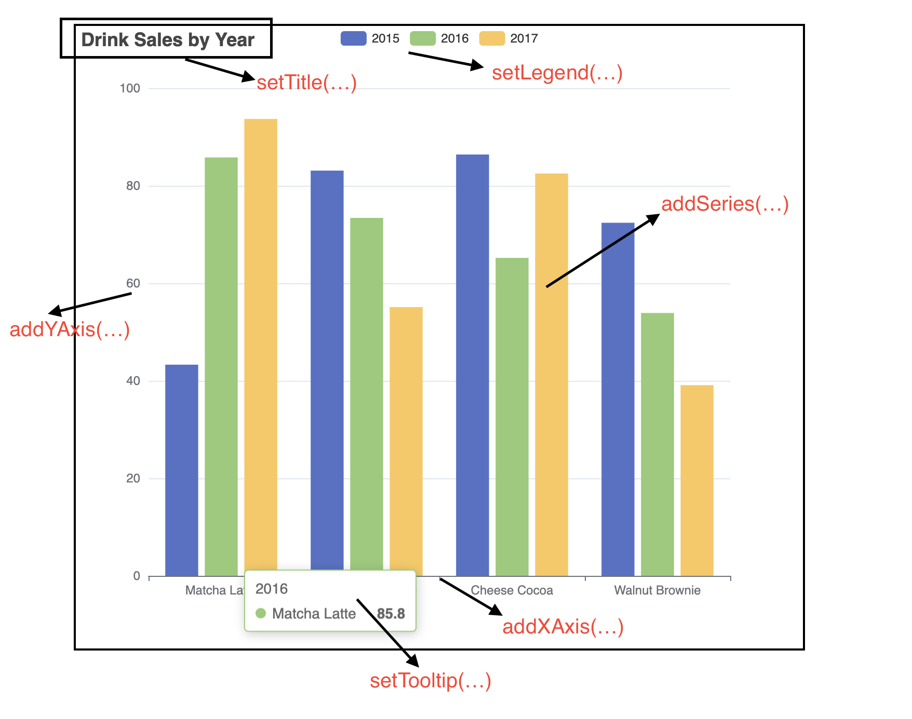

# 快速开始

## 如何安装

Maven项目:
```xml
// pom.xml
<dependency>
  <groupId>org.icepear.echarts</groupId>
  <artifactId>echarts-java</artifactId>
  <version>1.0.2</version>
</dependency>
```

Gradle项目:
```
implementation 'org.icepear.echarts:echarts-java:1.0.2'
```

如果你使用的是其他项目，请参阅[这里](https://search.maven.org/artifact/org.icepear.echarts/echarts-java/1.0.2/jar)。

## 立刻上手

### 在本地实现可视化图表，并下载保存

?> 现在我们来绘制我们的第一个EChart！ECharts Java可以生成任何你想要的可视化图表，你可以在浏览器里打开这些图表，并且将他们以图片的方式保存到本地。

```java
public static void main(String[] args) {
    // All methods in ECharts Java supports method chaining
    Bar bar = new Bar()
            .setTooltip(new Tooltip().setTrigger("axis")
                    .setAxisPointer(new TooltipAxisPointer().setType("shadow")))
            .setLegend(true)
            .addXAxis()
            .addYAxis(new String[] { "Mon", "Tue", "Wed", "Thu", "Fri", "Sat", "Sun" })
            .addSeries(createSeries("Direct", new Number[] { 320, 302, 301, 334, 390, 330, 320 }))
            .addSeries(createSeries("Mail Ad", new Number[] { 120, 132, 101, 134, 90, 230, 210 }))
            .addSeries(createSeries("Affiliate Ad", new Number[] { 220, 182, 191, 234, 290, 330, 310 }))
            .addSeries(createSeries("Video Ad", new Number[] { 150, 212, 201, 154, 190, 330, 410 }))
            .addSeries(createSeries("Search Engine", new Number[] { 820, 832, 901, 934, 1290, 1330, 1320 }));
    Engine engine = new Engine();
    // The render method will generate our EChart into a HTML file saved locally in the current directory.
    // The name of the HTML can also be set by the first parameter of the function.
    engine.render("index.html", bar);
}
```
[basic-area-html](../_media/bar/multiple-series-bar.html ':include :type=iframe')

### 构建Option Object

?> ECharts中，一切图表皆Option。如果想绘制基础的图表，ECharts Java提供了很多方便易用的API，你可以直接使用他们来直接绘图，然后用`getOption()`方法获取到JSON序列化后的Option对象。

```java
// Construct Option object using the simplified Chart APIs
Line lineChart = new Line()
                .addXAxis(new CategoryAxis()
                        .setData(new String[] { "Mon", "Tue", "Wed", "Thu", "Fri", "Sat", "Sun" })
                        .setBoundaryGap(false))
                .addYAxis()
                .addSeries(new LineSeries()
                        .setData(new Number[] { 820, 932, 901, 934, 1290, 1330, 1320 })
                        .setAreaStyle(new LineAreaStyle()));
            
// Every Chart has its own Option Object
Option option = lineChart.getOption();
// It is recommended that you can  get the serialized version of Option in the representation of JSON, which can be used directly in the template or in the RESTful APIs.
Engine engine = new Engine();
String jsonStr = engine.renderJsonOption(lineChart);
```

返回的JSON字符串如下：

```json
{
  "xAxis": [
    {
      "type": "category",
      "data": ["Mon", "Tue", "Wed", "Thu", "Fri", "Sat", "Sun"],
      "boundaryGap": false
    }
  ],
  "yAxis": [{ "type": "value" }],
  "series": [
    {
      "type": "line",
      "data": [820, 932, 901, 934, 1290, 1330, 1320],
      "areaStyle": {}
    }
  ]
}
```

?> 如果想绘制更高级的图表，或是想对图表实现更精细的控制，我们推荐你从零开始构建一个Option对象。 ECharts Java提供了一系列可供链式调用的、简单的API接口，供你更方便地构建Option，并且返回JSON序列化后的Option对象。

```java
// Construct Option object of a Bar chart using the advanced APIs
CategoryAxis xAxis = new CategoryAxis()
                .setType("category")
                .setData(new String[] { "Mon", "Tue", "Wed", "Thu", "Fri", "Sat", "Sun" });

ValueAxis yAxis = new ValueAxis().setType("value");

BarSeries series = new BarSeries()
        .setData(new Number[] { 120, 200, 150, 80, 70, 110, 130 })
        .setType("bar");

Option option = new Option()
        .setXAxis(xAxis)
        .setYAxis(yAxis)
        .setSeries(new SeriesOption[] { series });
```

如果想更详细地了解Option对象，可以参阅有关[APIs](zh-cn/chart-apis/cartesian-coord-chart)的文档，或是[Apache ECharts的官方文档](https://echarts.apache.org/en/option.html#title)。


### 网络框架集成

你可以很容易地将ECharts Java集成至当前许多流行的Web框架，例如Spring Boot。请参阅我们的[Spring Boot集成文档](zh-cn/spring-boot/sb-template)。

## 图表APIs介绍

Chart APIs是由ECharts Java提供的一系列更方便绘图的API接口。所有Chart的相关类都从图表中抽象出来。下面举例说明Chart APIs和图表的对应关系。

```java
Bar bar = new Bar()
        .setTitle("Drink Sales by Year")
        .setLegend(true)
        .setTooltip("item")
        .addXAxis(new String[] { "Matcha Latte", "Milk Tea", "Cheese Cocoa", "Walnut Brownie" })
        .addYAxis()
        .addSeries("2015", new Number[] { 43.3, 83.1, 86.4, 72.4 })
        .addSeries("2016", new Number[] { 85.8, 73.4, 65.2, 53.9 })
        .addSeries("2017", new Number[] { 93.7, 55.1, 82.5, 39.1 });
```



因为不同的图表结构不同，如果想更详细地了解图表APIs，请参阅[APIs](zh-cn/chart-apis/cartesian-coord-chart)。